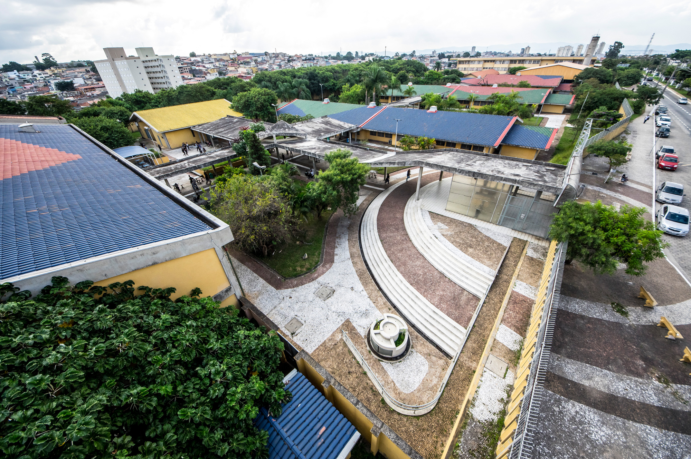
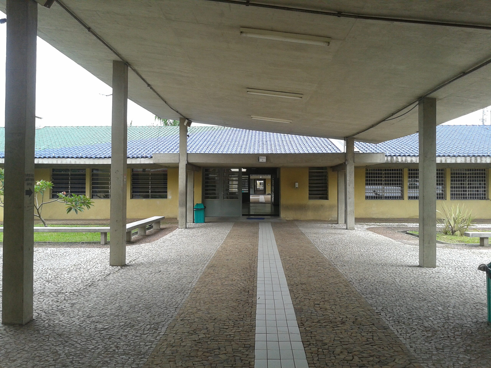
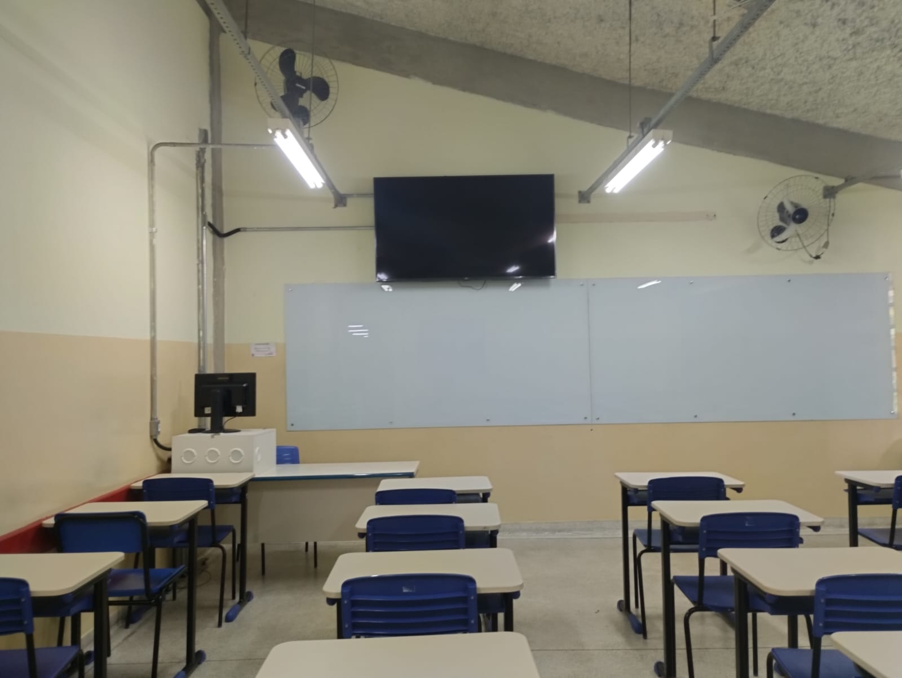
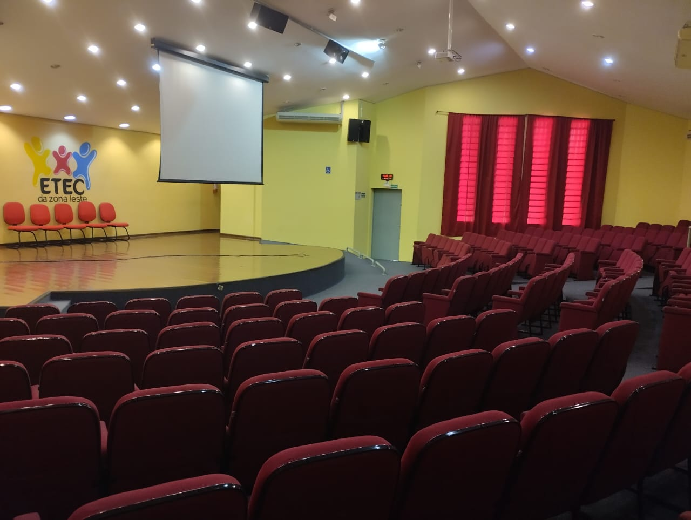
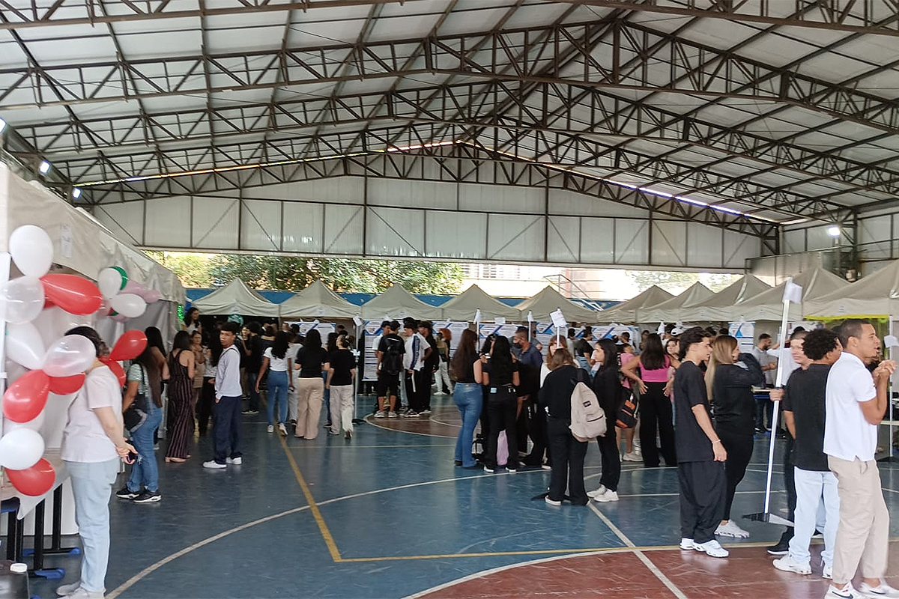

# Etec Zona Leste


Projeto de site institucional desenvolvido com foco em apresentar a Etec Zona Leste de forma visual, organizada e responsiva.

O portal reúne páginas informativas, calendário letivo, notícias, comunicados em PDF e formulário de contato com processamento em PHP.

## Visão Geral

Este projeto foi construído com páginas separadas em HTML, estilização em CSS e tratamento do formulário em PHP.

O objetivo é oferecer uma navegação clara entre as principais áreas do portal:

- Início
- Instituição
- Cursos
- Calendário 2026
- Notícias
- Contato

## Tecnologias Utilizadas

- HTML5
- CSS3
- PHP

## Páginas do Projeto

### Início

Página principal com apresentação da unidade, atalhos rápidos e informações institucionais.

### Instituição

Página com resumo da escola, missão educacional, estrutura e galeria com imagens da Etec Zona Leste.

### Cursos

Área com os cursos e modalidades oferecidas pela unidade.

### Calendário 2026

Página dedicada ao calendário letivo com acesso ao arquivo PDF.

### Notícias

Seção com destaques da unidade, incluindo notícia sobre a Feira do Empreendedor 2026 e área de comunicados.

### Contato

Página com formulário para envio de mensagem e confirmação do envio em PHP.

## Recursos do Site

- Navegação entre páginas
- Layout responsivo
- Identidade visual institucional
- Galeria de imagens da unidade
- PDFs organizados em pasta própria
- Link para Instagram oficial
- Formulário com retorno de confirmação

## Imagens do Projeto

### Vista da unidade



### Espaços internos







### Evento escolar



## Formulário de Contato

O formulário permite preencher:

- Nome
- E-mail
- Assunto
- Mensagem

Após o envio, o usuário é direcionado para uma página de confirmação com os dados informados.

Arquivo responsável pelo processamento:

- `contato.php`

## Estrutura de Pastas

```bash
.
├── index.html
├── instituicao.html
├── cursos.html
├── calendario.html
├── noticias.html
├── contato.html
├── contato.php
├── style.css
├── README.md
└── arquivos
    ├── logo-etec.png
    ├── imagens
    └── documentos
```

## Como Executar

1. Baixe ou clone este repositório.
2. Abra os arquivos HTML no navegador.
3. Para testar o formulário em PHP, execute o projeto em um servidor local com suporte a PHP.

## Observação Sobre os Prints

Este README já está preparado para apresentação no GitHub, mas os prints reais das telas do navegador ainda podem ser adicionados depois para deixar a apresentação mais completa.

Se quiser, você pode incluir imagens como:

- Página inicial aberta no navegador
- Página de instituição
- Página de notícias
- Formulário de contato preenchido
- Página de confirmação após envio do formulário

## Autor

Projeto desenvolvido para apresentação do portal institucional da Etec Zona Leste.
