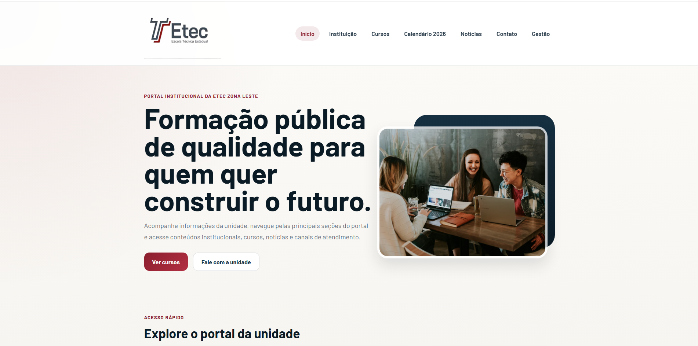

# 💻 Portal ETEC - Projeto Web

## 📌 Sobre o projeto

Este projeto é uma recriação do portal institucional da ETEC, com múltiplas páginas e um layout inspirado no site original.

---

## 🚀 Funcionalidades

* Navegação entre páginas
* Layout inspirado no site oficial
* Formulário funcional com JS
* Estrutura organizada

---

## 🖼️ Preview do projeto

---

## 🎥 Demonstração do projeto

[▶️ Assistir demonstração](https://drive.google.com/file/d/1RUUhiteHiJ5CJsujUCg3LEr55P4XMuHh/view?usp=sharing)

---

##  📝  Demonstração do Formulario

[▶️ Assistir demonstração do formulario](https://drive.google.com/file/d/1RUUhiteHiJ5CJsujUCg3LEr55P4XMuHh/view?usp=sharing)

